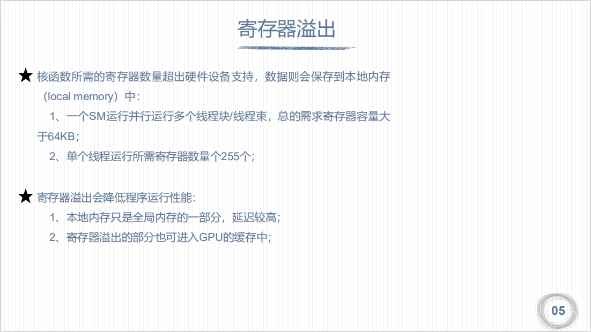

# cuda内存模型

## 流多处理器

线程束中的线程是并行的

## 线程模型与物理模型结构

## 线程束

## 内存结构层次
> 查看gpu内存使用情况
> nvcc --resource-usage hello.cu -o hello -arch=sm_61  sm_61(计算能力)

## cuda内存模型

## 寄存器

## 本地内存

## 共享内存

1. 在定义共享内存的时候，一般需要定义长度等于线程块大小的数组
2. 核函数里面的第三个参数就是指定的动态共享内存的大小`kernel<<<grid, block, 32>>>();`

## 全局内存

1. 静态全局内存的数量是在编译期就确定下来的，需要在所有的主机和设备外面进行定义声明。
2. 在核函数里面可以直接对静态全局内存进行访问。
3. 主机函数不能直接访问静态全局变量，通过cudaMemcpyToSymbol, cudaMemcpyFromSymbol进行通信

## 常量内存

1. 常量内存必须定义在核函数/主机函数之外
2. `__global__ void kernel(int N)`  // 这里的N就是存放在常量内存中的

