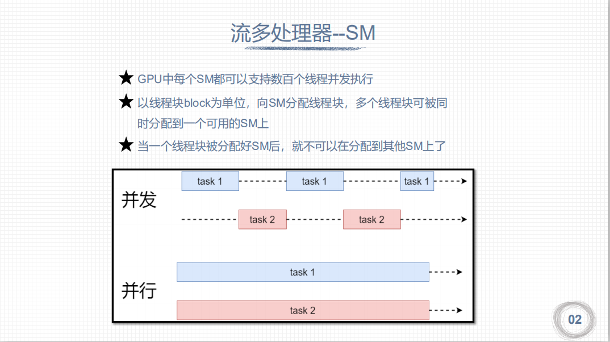

# cuda内存模型

## 流多处理器SM




GPU中每个SM都能支持数百个线程并发执行，每个GPU通常有多个SM,当一个核函数的网格被启动的时候，多个block会被同时分配给可用的
SM上执行

线程束中的线程是并行的，在某时刻T,SM上只执行一个线程束，也就是32个线程在同时同步执行，线程束中的每个线程执行同一个指令，包括有分支的部分。

在Fermi架构中，每个SM有两个线程束调度器，和两个指令调度单元，当一个线程块被指定给一个SM时，线程块内的所有线程被分成线程束，两个线程束选择其中两个线程束，在用指令调度器存储两个线程束要执行的指令。当某个线程块被分配到一个SM上的时候，会被分成多个线程束，线程束在SM上交替执行：


## SIMD vs SIMT
> 单指令多数据SIMD vs 单指令多线程SIMT
1. 单指令多数据: 单指令多数据的执行属于向量机，比如我们有四个数字要加上四个数字，那么我们可以用这种单指令多数据的指令来一次完成本来要做四次的运算。这种机制的问题就是过于死板，不允许每个分支有不同的操作，所有分支必须同时执行相同的指令，必须执行没有例外。
2. 单指令多线程: 相比之下单指令多线程SIMT就更加灵活了，虽然两者都是将相同指令广播给多个执行单元，但是SIMT的某些线程可以选择不执行
也就是说同一时刻所有线程被分配给相同的指令，SIMD规定所有人必须执行，而SIMT则规定有些人可以根据需要不执行，这样SIMT就保证了线程级别的并行，而SIMD更像是指令级别的并行。
SIMT包括以下SIMD不具有的关键特性：

    + 每个线程都有自己的指令地址计数器
    + 每个县城都有自己的寄存器状态
    + 每个线程可以有一个独立的执行路径

而上面这三个特性在编程模型可用的方式就是给每个线程一个唯一的标号（blckIdx,threadIdx），并且这三个特性保证了各线程之间的独立。

从概念上讲，32是SM以SIMD方式同时处理的工作粒度，一个SM上在某一个时刻，有32个线程在执行同一条指令，这32个线程可以选择性执行，虽然有些可以不执行，但是他也不能执行别的指令，需要另外需要执行这条指令的线程执行完，然后再继续下一条

## 线程模型与物理模型结构


因为SM有限，虽然我们的编程模型层面看所有线程都是并行执行的，但是在微观上看，所有线程块也是分批次的在物理层面的机器上执行，线程块里不同的线程可能进度都不一样，但是同一个线程束内的线程拥有相同的进度。
并行就会引起竞争，多线程以未定义的顺序访问同一个数据，就导致了不可预测的行为，CUDA只提供了一种块内同步的方式，块之间没办法同步！

同一个SM上可以有不止一个常驻的线程束，有些在执行，有些在等待，他们之间状态的转换是不需要开销的。

## 线程束


## 线程束分化
> 具体代码分析见: 
> 1.(单个分支结构放到同一个线程束中)thread_warp/thread_warp_demo01
> 2.(避免分支分化_规约问题) thread_warp/thread_warp_demo02

+ [参考链接: 避免分支分化](https://face2ai.com/CUDA-F-3-4-%E9%81%BF%E5%85%8D%E5%88%86%E6%94%AF%E5%88%86%E5%8C%96/)

假设下面这段代码是核函数的一部分，那么当一个线程束的32个线程执行这段代码的时候，如果其中16个执行if中的代码段，而另外16个执行else中的代码块，同一个线程束中的线程，执行不同的指令，这叫做线程束的分化。
```
if (con)
{
    //do something
}
else
{
    //do something
}
```
+ 优化方向: 避免同一个线程束内的线程分化，而让我们能控制线程束内线程行为的原因是线程块中线程分配到线程束是有规律的而不是随机的。这就使得我们根据线程编号来设计分支是可以的，补充说明下，当一个线程束中所有的线程都执行if或者，都执行else时，不存在性能下降；只有当线程束内有分歧产生分支的时候，性能才会急剧下降。

线程束内的线程是可以被我们控制的，那么我们就把都执行if的线程塞到一个线程束中，或者让一个线程束中的线程都执行if，另外线程都执行else的这种方式可以将效率提高很多。

## 内存结构层次
> 查看gpu内存使用情况
> `nvcc --resource-usage hello.cu -o hello -arch=sm_61`  sm_61(计算能力)


## cuda内存模型


## 寄存器


1. 在核函数内不加修饰的声明一个变量，改变了存储在寄存器中。在核函数中有常数长度的数组也是在寄存器中分配地址的。
2. 寄存器对于每个线程是私有的。寄存器变量的生命周期和核函数一致。如果一个线程里面变量太多，寄存器不够用。这时会发生寄存器
溢出，本地内存就会过来帮忙存储多出来的变量，这种情况对效率产生非常负面的影响。

为了避免寄存器溢出，可以在核函数的代码中配置额外的信息来辅助编译器优化，比如：
```
__global__ void
__lauch_bounds__(maxThreadaPerBlock,minBlocksPerMultiprocessor)
kernel(...) {
    /* kernel code */
}
```
这里面在核函数定义前加了一个 关键字 lauch_bounds，然后他后面对应了两个变量：

1. maxThreadaPerBlock：线程块内包含的最大线程数，线程块由核函数来启动
2. minBlocksPerMultiprocessor：可选参数，每个SM中预期的最小的常驻内存块参数。

注意，对于一定的核函数，优化的启动边界会因为不同的结构而不同

也可以在编译选项中加入`-maxrregcount=32`来控制一个编译单元里所有核函数使用的最大数量。

## 本地内存


核函数中符合存储在寄存器中但不能进入被核函数分配的寄存器空间中的变量将存储在本地内存中，
编译器可能存放在本地内存中的变量有以下几种：
+ 使用未知索引引用的本地数组
+ 可能会占用大量寄存器空间的较大本地数组或者结构体
+ 任何不满足核函数寄存器限定条件的变量

本地内存实质上是和全局内存一样在同一块存储区域当中的，其访问特点——高延迟，低带宽。
对于2.0以上的设备，本地内存存储在每个SM的一级缓存，或者设备的二级缓存上。


## 共享内存


1. 在定义共享内存的时候，一般需要定义长度等于线程块大小的数组
2. 核函数里面的第三个参数就是指定的动态共享内存的大小`kernel<<<grid, block, 32>>>();`

每个SM都有一定数量的由线程块分配的共享内存，共享内存是片上内存，跟主存相比，速度要快很多，也即是延迟低，带宽高。其类似于一级缓存，但是可以被编程。

使用共享内存的时候一定要注意，不要因为过度使用共享内存，而导致SM上活跃的线程束减少，也就是说，一个线程块使用的共享内存过多，导致更过的线程块没办法被SM启动，这样影响活跃的线程束数量。

共享内存在核函数内声明，生命周期和线程块一致，线程块运行开始，此块的共享内存被分配，当此块结束，则共享内存被释放。

因为共享内存是块内线程可见的，所以就有竞争问题的存在，也可以通过共享内存进行通信，当然，为了避免内存竞争，可以使用同步语句：
```
void __syncthreads();
```
此语句相当于在线程块执行时各个线程的一个障碍点，当块内所有线程都执行到本障碍点的时候才能进行下一步的计算，这样可以设计出避免内存竞争的共享内存使用程序、
注意，__syncthreads();频繁使用会影响内核执行效率。
SM中的一级缓存，和共享内存共享一个64k的片上内存（不知道现在的设备有没有提高），他们通过静态划分，划分彼此的容量，运行时可以通过下面语句进行设置：
```
cudaError_t cudaFuncSetCacheConfig(const void * func,enum cudaFuncCache);
```
这个函数可以设置内核的共享内存和一级缓存之间的比例。cudaFuncCache参数可选如下配置：
Fermi架构支持前三种，后面的设备都支持。
```
cudaFuncCachePreferNone//无参考值，默认设置
cudaFuncCachePreferShared//48k共享内存，16k一级缓存
cudaFuncCachePreferL1// 48k一级缓存，16k共享内存
cudaFuncCachePreferEqual// 32k一级缓存，32k共享内存
```


## 全局内存


1. 静态全局内存的数量是在编译期就确定下来的，需要在所有的主机和设备外面进行定义声明。
2. 在核函数里面可以直接对静态全局内存进行访问。
3. 主机函数不能直接访问静态全局变量，通过cudaMemcpyToSymbol, cudaMemcpyFromSymbol进行通信

全局内存可以动态声明，或者静态声明，可以用下面的修饰符在设备代码中静态的声明一个变量：
```
__device__
```
因为全局内存的性质，当有多个核函数同时执行的时候，如果使用到了同一全局变量，应注意内存竞争。

全局内存访问是对齐，也就是一次要读取指定大小（32，64，128）整数倍字节的内存，所以当线程束执行内存加载/存储时，需要满足的传输数量通常取决与以下两个因素：
1. 跨线程的内存地址分布
2. 内存事务的对齐方式。

一般情况下满足内存请求的事务越多，未使用的字节被传输的可能性越大，数据吞吐量就会降低，换句话说，对齐的读写模式使得不需要的数据也被传输，所以，利用率低到时吞吐量下降。1.1以下的设备对内存访问要求非常严格（为了达到高效，访问受到限制）因为当时还没有缓存，现在的设备都有缓存了，所以宽松了一些。


## 常量内存


1. 常量内存必须定义在核函数/主机函数之外
2. `__global__ void kernel(int N)`  // 这里的N就是存放在常量内存中的

常量内存驻留在设备内存中，每个SM都有专用的常量内存缓存，常量内存使用：`__constant__`修饰，常量内存在核函数外，全局范围内声明，对于所有设备，只可以声明64k的常量内存，常量内存静态声明，并对同一编译单元中的所有核函数可见。

叫常量内存，显然是不能被修改的，这里不能被修改指的是被核函数修改，主机端代码是可以初始化常量内存的，不然这个内存谁都不能改就没有什么使用意义了，常量内存，被主机端初始化后不能被核函数修改，初始化函数如下：
```
cudaError_t cudaMemcpyToSymbol(const void* symbol,const void *src,size_t count);
```
同 cudaMemcpy的参数列表相似，从src复制count个字节的内存到symbol里面，也就是设备端的常量内存。多数情况下此函数是同步的，也就是会马上被执行。

当线程束中所有线程都从相同的地址取数据时，常量内存表现较好，比如执行某一个多项式计算，系数都存在常量内存里效率会非常高，但是如果不同的线程取不同地址的数据，常量内存就不那么好了，因为常量内存的读取机制是：
一次读取会广播给所有线程束内的线程。

## 纹理内存
纹理内存驻留在设备内存中，在每个SM的只读缓存中缓存，纹理内存是通过指定的缓存访问的全局内存，只读缓存包括硬件滤波的支持，它可以将浮点插入作为读取过程中的一部分来执行，纹理内存是对二维空间局部性的优化。

总的来说纹理内存设计目的应该是为了GPU本职工作显示设计的，但是对于某些特定的程序可能效果更好，比如需要滤波的程序，可以直接通过硬件完成。

## GPU缓存
与CPU缓存类似，GPU缓存不可编程，其行为出厂是时已经设定好了。GPU上有4种缓存：
1. 一级缓存
2. 二级缓存
3. 只读常量缓存
4. 只读纹理缓存

每个SM都有一个一级缓存，所有SM公用一个二级缓存。一级二级缓存的作用都是被用来存储本地内存和全局内存中的数据，也包括寄存器溢出的部分(溢出到本地内存中)。Fermi，Kepler以及以后的设备，CUDA允许我们配置读操作的数据是使用一级缓存和二级缓存，还是只使用二级缓存。

## 设备存储器重要特征
| 存储器 | 片上/片外 | 缓存 | 存取 | 范围 | 生命周期 |
| ----  | ----     | ---- | ---- | ---- | ----   |
| 寄存器 | 片上 | n/a | R/W | 一个线程 | 线程 |
| 本地 | 片外 | 1.0以上有 | R/W | 一个线程 | 线程 |
| 共享 | 片上 |  n/a | R/W | 块内所有线程 | 块 |
| 全局 | 片外 | 1.0以上有 | R/W | 所有线程+主机 | 主机配置 |
| 常量 | 片外 | Yes | R | 所有线程+主机 | 主机配置 |
| 纹理 | 片外 | Yes | R | 所有线程+主机 | 主机配置 |

## 固定内存
主机内存采用分页式管理，通俗的说法就是操作系统把物理内存分成一些“页”，然后给一个应用程序一大块内存，但是这一大块内存可能在一些不连续的页上，应用只能看到虚拟的内存地址，而操作系统可能随时更换物理地址的页（从原始地址复制到另一个地址）但是应用是不会差觉得，但是从主机传输到设备上的时候，如果此时发生了页面移动，对于传输操作来说是致命的，所以在数据传输之前，CUDA驱动会锁定页面，或者直接分配固定的主机内存，将主机源数据复制到固定内存上，然后从固定内存传输数据到设备上：

上图左边是正常分配内存，传输过程是：锁页-复制到固定内存-复制到设备
右边时分配时就是固定内存，直接传输到设备上。

下面函数用来分配固定内存：
```
cudaError_t cudaMallocHost(void ** devPtr,size_t count)
```
分配count字节的固定内存，这些内存是页面锁定的，可以直接传输到设备的
固定的主机内存释放使用：
```
cudaError_t cudaFreeHost(void *ptr)
```
结论：
固定内存的释放和分配成本比可分页内存要高很多，但是传输速度更快，所以对于大规模数据，固定内存效率更高。
尽量使用流来使内存传输和计算之间同时进行。\

## 内存访问模式
+ [内存访问模式参考链接](https://face2ai.com/CUDA-F-4-3-%E5%86%85%E5%AD%98%E8%AE%BF%E9%97%AE%E6%A8%A1%E5%BC%8F/)

1. 核函数运行时需要从全局内存(DRAM)中读取数据，只有两种粒度。如果启用一级缓存，粒度是128字节。如果不启用一级缓存，只是用二级缓存，那么粒度是32字节。SM执行的基础是线程束，也就是说，当一个SM中正在被执行的某个线程需要访问内存，那么，和它同线程束的其他31个线程也要访问内存，这个基础就表示，即使每个线程只访问一个字节，那么在执行的时候，只要有内存请求，至少是32个字节，所以不使用一级缓存的内存加载，一次粒度是32字节而不是更小。
2. 需要关注以下两个特性:
+ 对齐内存访问
+ 合并内存访问

内存对其访问：当一个内存事务的首个访问地址是缓存粒度（32或128字节）的偶数倍的时候：比如二级缓存32字节的偶数倍64，128字节的偶数倍256的时候，这个时候被称为对齐内存访问，非对齐访问就是除上述的其他情况，非对齐的内存访问会造成带宽浪费。

合并内存访问: 当一个线程束内的线程访问的内存都在一个内存块里的时候，就会出现合并访问。

对齐合并内存访问：对齐合并访问的状态是理想化的，也是最高速的访问方式，当线程束内的所有线程访问的数据在一个内存块，并且数据是从内存块的首地址开始被需要的，那么对齐合并访问出现了。为了最大化全局内存访问的理想状态，尽量将线程束访问内存组织成对齐合并的方式，这样的效率是最高的。

控制全局加载操作是否通过一级缓存可以通过编译选项进行控制
```
// 编译器禁用一级缓存的选项
-Xptxas -dlcm=cg

// 编译器启用一级缓存的选项
-Xptxas -dlcm=ca
```
当一级缓存被禁用的时候，对全局内存的加载请求直接进入二级缓存，如果二级缓存缺失，则由DRAM完成请求

当启用一级缓存后，当SM有全局加载请求会首先通过尝试一级缓存，如果一级缓存缺失，则尝试二级缓存，如果二级缓存也没有，那么直接DRAM。

内存访问有以下特点：
+ 是否使用缓存：一级缓存是否介入加载过程
+ 对齐与非对齐的：如果访问的第一个地址是32的倍数（前面说是32或者128的偶数倍，这里似乎产生了矛盾，为什么我现在也很迷惑）
+ 合并与非合并，访问连续数据块则是合并的

全局内存写入不像读取，存储操作在32个字节的粒度上进行。

### 结构体数组和数组结构体
数组结构体(AoS)就是一个数组，每个元素都是一个结构体，而结构体数组(SoA)就是结构体中的成员是数组。
AoS:
```
struct A a[N]
```
SoA:
```
struct A {
    int a[N];
    int b[N];
}
```

CUDA对细腻度数组非常友好，但是对于粗粒度的数组结构体(AoS)就不太友好，内存访问利用率低。即：当一个线程要访问结构体中的某个成员时，当32个线程同时访问的时候，SoA访问是连续的，但是AoS是不连续的。

这里AoS访问的效率只有50%