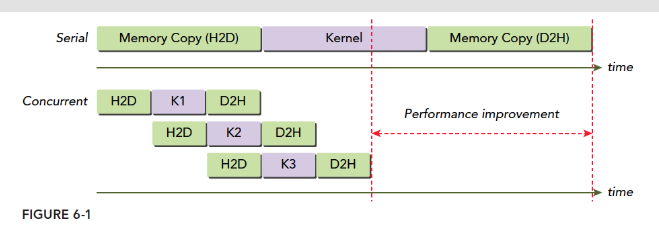
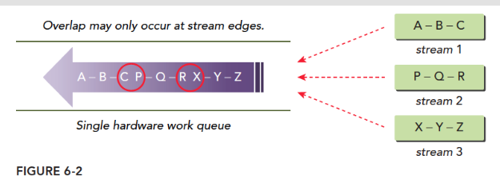
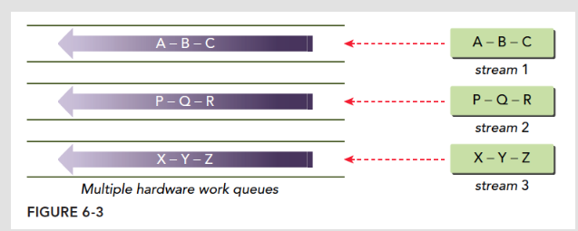
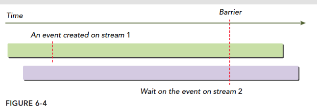

# cuda流
> 一般来说cuda程序有两个并发，分别是内核级并发(前面介绍的，统一内核多线程的并行)，网格级并发。
> 这里的研究在内核之上研究并行，也就是多个内核的并行。使用cuda流实现网格级并发

## 流和事件概述
[流和事件概述](https://face2ai.com/CUDA-F-6-1-%E6%B5%81%E5%92%8C%E4%BA%8B%E4%BB%B6%E6%A6%82%E8%BF%B0/)

CUDA流：一系列异步CUDA操作，比如我们常见的套路，在主机端分配设备主存（cudaMalloc），主机向设备传输数据（cudaMemcpy），核函数启动，复制数据回主机（Memcpy）这些操作中有些是异步的，执行顺序也是按照主机代码中的顺序执行的（但是异步操作的结束不一定是按照代码中的顺序的）。 流能封装这些异步操作，并保持操作顺序，允许操作在流中排队。保证其在前面所有操作启动之后启动，有了流，我们就能查询排队状态了。

一个流中的不同操作有着严格的顺序。但是不同流之间是没有任何限制的。多个流同时启动多个内核，就形成了网格级别的并行。

一般的生产情况下，内核执行的时间要长于数据传输，所以我们前面的例子大多是数据传输更耗时，这是不实际的。当重叠核函数执行和数据传输操作，可以屏蔽数据移动造成的时间消耗，当然正在执行的内核的数据需要提前复制到设备上的，这里说的数据传输和内核执行是同时操作的是指当前传输的数据是接下来流中的内核需要的。这样总的执行时间就被缩减了。

流在CUDA的API调用可以实现流水线和双缓冲技术。
CUDA的API也分为同步和异步的两种：
+ 同步行为的函数会阻塞主机端线程直到其完成
+ 异步行为的函数在调用后会立刻把控制权返还给主机。

异步行为和流式构建网格级并行的支柱。
虽然我们从软件模型上提出了流，网格级并行的概念，但是说来说去我们能用的就那么一个设备，如果设备空闲当然可以同时执行多个核，但是如果设备已经跑满了，那么我们认为并行的指令也必须排队等待——PCIe总线和SM数量是有限的，当他们被完全占用，流是没办法做什么的，除了等待

### CUDA流
我们的所有CUDA操作都是在流中进行的，虽然我们可能没发现，但是有我们前面的例子中的指令，内核启动，都是在CUDA流中进行的，只是这种操作是隐式的，所以肯定还有显式的，所以，流分为：
+ 隐式声明的流，我们叫做空流
+ 显式声明的流，我们叫做非空流

如果我们没有特别声明一个流，那么我们的所有操作是在默认的空流中完成的。空流是没办法管理的，因为他连个名字都没有，似乎也没有默认名，所以当我们想控制流，非空流是非常必要的

基于流的异步内核启动和数据传输支持以下类型的粗粒度并发
1. 重叠主机和设备计算
2. 重叠主机计算和主机设备数据传输
3. 重叠主机设备数据传输和设备计算
4. 并发设备计算（多个设备）

CUDA编程和普通的C++不同的就是，我们有两个“可运算的设备”也就是CPU和GPU这两个东西，这种情况下，他们之间的同步并不是每一步指令都互相通信执行进度的，设备不知道主机在干啥，主机也不是完全知道设备在干啥。但是数据传输是同步的，也就是主机要等设备接收完数据才干别的。

数据传输的异步版本:
```
cudaError_t cudaMemcpyAsync(void* dst, const void* src, size_t count,cudaMemcpyKind kind, cudaStream_t stream = 0);
```
值得注意的就是最后一个参数，stream表示流，一般情况设置为默认流，这个函数和主机是异步的，执行后控制权立刻归还主机，当然我们需要声明一个非空流：
```
cudaError_t cudaStreamCreate(cudaStream_t* pStream);
```
这样我们就有一个可以被管理的流了，这段代码是创建了一个流给流命名声明流的操作是：
```
cudaStream_t a;
```
定义了一个叫a的流，但是这个流没法用，相当于只有了名字，资源还是要用cudaStreamCreate分配的。

**执行异步数据传输时，主机端的内存必须是固定的，非分页的！！**
```
cudaError_t cudaMallocHost(void **ptr, size_t size);
cudaError_t cudaHostAlloc(void **pHost, size_t size, unsigned int flags);
```
主机虚拟内存中分配的数据在物理内存中是随时可能被移动的，我们必须确保其在整个生存周期中位置不变，这样在异步操作中才能准确的转移数据，否则如果操作系统移动了数据的物理地址，那么我们的设备可能还是回到之前的物理地址取数据，这就会出现未定义的错误。

在非空流中执行内核需要在启动核函数的时候加入一个附加的启动配置：
```
kernel_name<<<grid, block, sharedMemSize, stream>>>(argument list);
```
stream参数就是附加的参数，使用目标流的名字作为参数，比如想把核函数加入到a流中，那么这个stream就变成a。

前面我们为一个流分配资源，当然后面就要回收资源，回收方式：
```
cudaError_t cudaStreamDestroy(cudaStream_t stream);
```
这个回收函数很有意思，由于流和主机端是异步的，你在使用上面指令回收流的资源的时候，很有可能流还在执行，这时候，这条指令会正常执行，但是不会立刻停止流，而是等待流执行完成后，立刻回收该流中的资源。这样做是合理的也是安全的。

当然，我们可以查询流执行的怎么样了，下面两个函数就是帮我们查查我们的流到哪了：
```
cudaError_t cudaStreamSynchronize(cudaStream_t stream);
cudaError_t cudaStreamQuery(cudaStream_t stream);
```
这两条执行的行为非常不同，cudaStreamSynchronize会阻塞主机，直到流完成。cudaStreamQuery则是立即返回，如果查询的流执行完了，那么返回cudaSuccess否则返回cudaErrorNotReady。

下面这段示例代码就是典型多个流中调度CUDA操作的常见模式：
```
for (int i = 0; i < nStreams; i++) {
    int offset = i * bytesPerStream;
    cudaMemcpyAsync(&d_a[offset], &a[offset], bytePerStream, streams[i]);
    kernel<<grid, block, 0, streams[i]>>(&d_a[offset]);
    cudaMemcpyAsync(&a[offset], &d_a[offset], bytesPerStream, streams[i]);
}
for (int i = 0; i < nStreams; i++) {
    cudaStreamSynchronize(streams[i]);
}
```
第一个for中循环执行了nStreams个流，每个流中都是“复制数据，执行核函数，最后将结果复制回主机”这一系列操作。

下面的图就是一个简单的时间轴示意图，假设nStreams=3，所有传输和核启动都是并发的：


H2D是主机到设备的内存传输，D2H是设备到主机的内存传输。显然这些操作没有并发执行，而是错开的，原因是PCIe总线是共享的，当第一个流占据了主线，后来的就一定要等待，等待主线空闲。编程模型和硬件的实际执行时有差距了。
上面同时从主机到设备涉及硬件竞争要等待，如果是从主机到设备和从设备到主机同时发生，这时候不会产生等待，而是同时进行。
内核并发最大数量也是有极限的，不同计算能力的设备不同，Fermi设备支持16路并发，Kepler支持32路并发。设备上的所有资源都是限制并发数量的原因，比如共享内存，寄存器，本地内存，这些资源都会限制最大并发数。

### 流调度
从编程模型看，所有流可以同时执行，但是硬件毕竟有限，不可能像理想情况下的所有流都有硬件可以使用，所以硬件上如何调度这些流是我们理解流并发的关键

#### 虚假的依赖关系
在Fermi架构上16路流并发执行但是所有流最终都是在单一硬件上执行的，Fermi只有一个硬件工作队列，所以他们虽然在编程模型上式并行的，但是在硬件执行过程中是在一个队列中（像串行一样）。当要执行某个网格的时候CUDA会检测任务依赖关系，如果其依赖于其他结果，那么要等结果出来后才能继续执行。单一流水线可能会导致虚假依赖关系：


这个图就是虚假依赖的最准确的描述，我们有三个流，流中的操作相互依赖，比如B要等待A的结果，Z要等待Y的结果，当我们把三个流塞到一个队列中，那么我们就会得到紫色箭头的样子，这个硬件队列中的任务可以并行执行，但是要考虑依赖关系，所以，我们按照顺序会这样执行：

1. 执行A，同时检查B是否有依赖关系，当然此时B依赖于A而A没执行完，所以整个队列阻塞
2. A执行完成后执行B，同时检查C，发现依赖，等待
3. B执行完后，执行C同时检查，发现P没有依赖，如果此时硬件有多于资源P开始执行
4. P执行时检查Q，发现Q依赖P，所以等待

这种一个队列的模式，会产生一种，虽然P依赖B的感觉，虽然不依赖，但是B不执行完，P没办法执行，而所谓并行，只有一个依赖链的头和尾有可能并行，也就是红圈中任务可能并行，而我们的编程模型中设想的并不是这样的。

#### Hyper-Q技术(多个工作队列)
解决上面虚假依赖的最好办法就是多个工作队列，这样就从根本上解决了虚假依赖关系，Hyper-Q就是这种技术，32个硬件工作队列同时执行多个流，这就可以实现所有流的并发，最小化虚假依赖：


#### 流的优先级
3.5以上的设备可以给流优先级，也就是优先级高的（数字上更小的，类似于C++运算符优先级）
优先级只影响核函数，不影响数据传输，高优先级的流可以占用低优先级的工作。
下面函数创建一个有指定优先级的流
```
cudaError_t cudaStreamCreateWithPriority(cudaStream_t* pStream, unsigned int flags,int priority);
```
不同的设备有不同的优先级等级，下面函数可以查询当前设备的优先级分布情况：
```
cudaError_t cudaDeviceGetStreamPriorityRange(int *leastPriority, int *greatestPriority);
```
leastPriority表示最低优先级（整数，远离0）
greatestPriority表示最高优先级（整数，数字较接近0）
如果设备不支持优先级返回0

## CUDA事件
CUDA事件不同于我们前面介绍的内存事务，不要搞混，事件也是软件层面上的概念。事件的本质就是一个标记，它与其所在的流内的特定点相关联。可以使用时间来执行以下两个基本任务：

+ 同步流执行
+ 监控设备的进展。流中的任意点都可以通过API插入事件以及查询事件完成的函数，只有事件所在流中其之前的操作都完成后才能触发事件完成。默认流中设置事件，那么其前面的所有操作都完成时，事件才出发完成。事件就像一个个路标，其本身不执行什么功能，就像我们最原始测试c语言程序的时候插入的无数多个printf一样。

**创建和销毁**:
事件的声明如下：
```
cudaEvent_t event;
```
同样声明完后要分配资源：
```
cudaError_t cudaEventCreate(cudaEvent_t* event);
```
回收事件的资源
```
cudaError_t cudaEventDestroy(cudaEvent_t event);
```
如果回收指令执行的时候事件还没有完成，那么回收指令立即完成，当事件完成后，资源马上被回收

**记录事件和计算运行时间**:
事件的一个主要用途就是记录事件之间的时间间隔。
事件通过下面指令添加到CUDA流：
```
cudaError_t cudaEventRecord(cudaEvent_t event, cudaStream_t stream = 0);
```
在流中的事件主要就是等待前面的操作完成，或者测试指定流中操作完成情况，下面和流类似的事件测试指令（是否出发完成）会阻塞主机线程直到事件被完成。
```
cudaError_t cudaEventSynchronize(cudaEvent_t event);
```
异步版本:
```
cudaError_t cudaEventQuery(cudaEvent_t event);
```
这个不会阻塞主机线程，而是直接返回结果和stream版本的类似。
另一个函数用在事件上的是记录两个事件之间的时间间隔：
```
cudaError_t cudaEventElapsedTime(float* ms, cudaEvent_t start, cudaEvent_t stop);
```
这个函数记录两个事件start和stop之间的时间间隔，单位毫秒，两个事件不一定是同一个流中。这个时间间隔可能会比实际大一些，因为cudaEventRecord这个函数是异步的，所以加入时间完全不可控，不能保证两个事件之间的间隔刚好是两个事件之间的。
一段简单的记录事件时间间隔的代码
```
// create two events
cudaEvent_t start, stop;
cudaEventCreate(&start);
cudaEventCreate(&stop);
// record start event on the default stream
cudaEventRecord(start);
// execute kernel
kernel<<<grid, block>>>(arguments);
// record stop event on the default stream
cudaEventRecord(stop);
// wait until the stop event completes
cudaEventSynchronize(stop);
// calculate the elapsed time between two events
float time;
cudaEventElapsedTime(&time, start, stop);
// clean up the two events
cudaEventDestroy(start);
cudaEventDestroy(stop);
```
这段代码显示，我们的事件被插入到空流中，设置两个事件作为标记，然后记录他们之间的时间间隔。
cudaEventRecord是异步的，所以间隔不准，这是特别要注意的。

## 流同步
同步好处是保证代码有可能存在内存竞争的地方降低风险，第二就是相互协调通信，当然坏处就是效率会降低，原因很简单，就是当部分线程等待的时候，设备有一些资源是空闲的，所以这会带来性能损耗。同样，在流中也有同步。

流分成阻塞流和非阻塞流，在非空流中所有操作都是非阻塞的，所以流启动以后，主机还要完成自己的任务，有时候就可能需要同步主机和流之间的进度，或者同步流和流之间的进度。

从主机的角度，CUDA操作可以分为两类：
+ 内存相关操作
+ 内核启动

内核启动总是异步的，虽然某些内存是同步的，但是他们也有异步版本

流分为两种类型:
1. 异步流(非空流)
2. 同步流(空流/默认流)

没有显式声明的流式默认同步流，程序员声明的流都是异步流，异步流通常不会阻塞主机，同步流中部分操作会造成阻塞，主机等待，什么都不做，直到某操作完成。

非空流并不都是非阻塞的，非空流也可以分为两种类型：
+ 阻塞流
+ 非阻塞流

虽然正常来讲，非空流都是异步操作，不存在阻塞主机的情况，但是有时候可能被空流中的操作阻塞。如果一个非空流被声明为非阻塞的，那么没人能阻塞他，如果声明为阻塞流，则会被空流阻塞。

有就是非空流有时候可能需要在运行到一半和主机通信，这时候我们更希望他能被阻塞，而不是不受控制，这样我们就可以自己设定这个流到底受不受控制，也就是是否能被阻塞，下面我们研究如何使用这两种流。

### 阻塞流与非阻塞流
> 使用空流阻塞非空流

cudaStreamCreate默认创建的是阻塞流(默认流)，意味着里面有些操作会被阻塞，直到空流中默写操作完成。
空流不需要显式声明，而是隐式的，他是阻塞的，跟所有阻塞流同步。

当操作A发布到空流中，A执行之前，CUDA会等待A之前的全部操作都发布到阻塞流中，所有发布到阻塞流中的操作都会挂起，等待，直到在此操作指令之前的操作都完成，才开始执行。
```
kernel_1<<<1, 1, 0, stream_1>>>();
kernel_2<<<1, 1>>>();
kernel_3<<<1, 1, 0, stream_2>>>();
```
上面这段代码，有三个流，两个有名字的，一个空流，我们认为stream_1和stream_2是阻塞流，空流是阻塞的，这三个核函数都在阻塞流上执行，具体过程是，kernel_1被启动，控制权返回主机，然后启动kernel_2，但是此时kernel_2 不会并不会马山执行，他会等到kernel_1执行完毕，同理启动完kernel_2 控制权立刻返回给主机，主机继续启动kernel_3,这时候kernel_3 也要等待，直到kernel_2执行完，但是从主机的角度，这三个核都是异步的，启动后控制权马上还给主机。

然后我们就想创建一个非阻塞流，因为我们默认创建的是阻塞版本：
```
cudaError_t cudaStreamCreateWithFlags(cudaStream_t* pStream, unsigned int flags);
```
第二个参数就是选择阻塞还是非阻塞版本：
```
cudaStreamDefault;// 默认阻塞流
cudaStreamNonBlocking: //非阻塞流，对空流的阻塞行为失效。
```
如果前面的stream_1和stream_2声明为非阻塞的，那么上面的调用方法的结果是三个核函数同时执行。

### 隐式同步
cudaMemcpy是隐式同步，也介绍了
```
cudaDeviceSynchronize;
cudaStreamSynchronize;
cudaEventSynchronize;
```
这几个也是同步指令，可以用来同步不同的对象，这些是显式的调用的；与上面的隐式不同。
隐式同步的指令其最原始的函数功能并不是同步，所以同步效果是隐式的，这个我们需要非常注意，忽略隐式同步会造成性能下降。所谓同步就是阻塞的意思，被忽视的隐式同步就是被忽略的阻塞，隐式操作常出现在内存操作上，比如：
+ 锁页主机内存分布
+ 设备内存分配
+ 设备内存初始化
+ 同一设备两地址之间的内存复制
+ 一级缓存，共享内存配置修改

这些操作都要时刻小心，因为他们带来的阻塞非常不容易察觉

### 显示同步
显式同步相比就更加光明磊落了，因为一条指令就一个作用，没啥副作用，常见的同步有：
+ 同步设备
+ 同步流
+ 同步流中的事件
+ 使用事件跨流同步

下面的函数就可以阻塞主机线程，直到设备完成所有操作：
```
cudaError_t cudaDeviceSynchronize(void);
```
这个函数我们前面常用，但是尽量少用，这个会拖慢效率。
然后是流版本的，我们可以同步流，使用下面两个函数：
```
cudaError_t cudaStreamSynchronize(cudaStream_t stream);
cudaError_t cudaStreamQuery(cudaStream_t stream);
```
这两个函数，第一个是同步流的，阻塞主机直到完成，第二个可以完成非阻塞流测试。也就是测试一下这个流是否完成。
我们提到事件，事件的作用就是在流中设定一些标记用来同步，和检查是否执行到关键点位（事件位置），也是用类似的函数
```
cudaError_t cudaEventSynchronize(cudaEvent_t event);
cudaError_t cudaEventQuery(cudaEvent_t event);
```
这两个函数的性质和上面的非常类似。
事件提供了一个流之间同步的方法：
```
cudaError_t cudaStreamWaitEvent(cudaStream_t stream, cudaEvent_t event);
```
这条命令的含义是，指定的流要等待指定的事件，事件完成后流才能继续，这个事件可以在这个流中，也可以不在，当在不同的流的时候，这个就是实现了**跨流同步**。
如下图


### 可配置事件
CDUA提供了一种控制事件行为和性能的函数：
```
cudaError_t cudaEventCreateWithFlags(cudaEvent_t* event, unsigned int flags);
```
其中参数是：
```
cudaEventDefault
cudaEventBlockingSync
cudaEventDisableTiming
cudaEventInterprocess
```
其中cudaEventBlockingSync指定使用cudaEventSynchronize同步会造成阻塞调用线程。cudaEventSynchronize默认是使用cpu周期不断重复查询事件状态，而当指定了事件是cudaEventBlockingSync的时候，会将查询放在另一个线程中，而原始线程继续执行，直到事件满足条件，才会通知原始线程，这样可以减少CPU的浪费，但是由于通讯的时间，会造成一定的延迟。
cudaEventDisableTiming表示事件不用于计时，可以减少系统不必要的开支也能提升cudaStreamWaitEvent和cudaEventQuery的效率
cudaEventInterprocess表明可能被用于进程之间的事件

## 并发内核执行
[并发内核执行](https://face2ai.com/CUDA-F-6-2-%E5%B9%B6%E5%8F%91%E5%86%85%E6%A0%B8%E6%89%A7%E8%A1%8C/)

## 重叠内核执行和数据传输
[重叠内核执行和数据传输](https://face2ai.com/CUDA-F-6-3-%E9%87%8D%E5%8F%A0%E5%86%85%E6%A0%B8%E6%89%A7%E8%A1%8C%E5%92%8C%E6%95%B0%E6%8D%AE%E4%BC%A0%E8%BE%93/)

## 重叠GPU和CPU的执行
[重叠GPU和CPU的执行](https://face2ai.com/CUDA-F-6-4-%E9%87%8D%E5%8F%A0GPU%E5%92%8CCPU%E7%9A%84%E6%89%A7%E8%A1%8C/)

## 流回调
[流回调](http://www.face2ai.com/CUDA-F-6-5-%E6%B5%81%E5%9B%9E%E8%B0%83/)